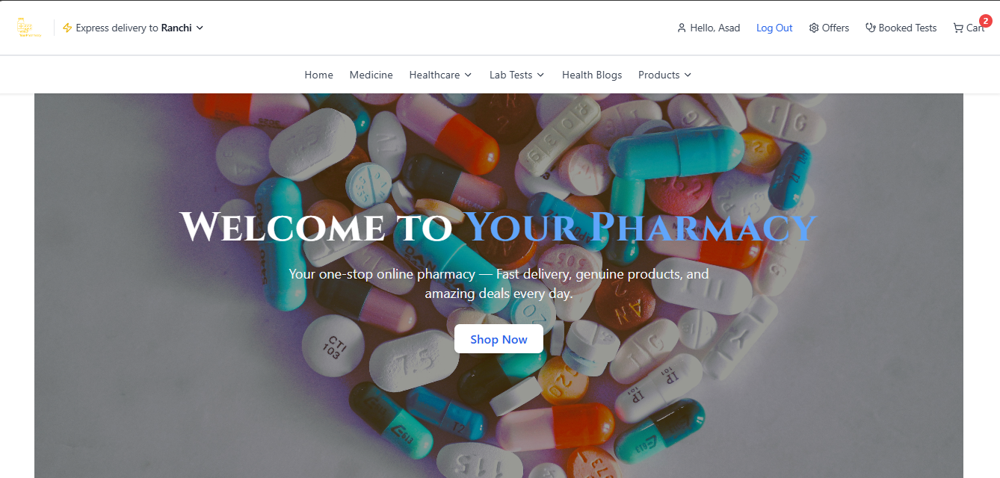

## Your Pharmacy

## Overview

Your Pharmacy is a full-featured online pharmacy platform built with React and Vite. It allows users to browse medicines, healthcare products, and lab tests, add items to the cart, and place orders. Admin users can manage orders through a dedicated dashboard.

This project emphasizes mobile responsiveness, user authentication, and real-time data management with Firebase Firestore.

## Features

Browse Medicines, Healthcare Products, and Lab Tests

Add to Cart and manage quantities

Place Orders with Cash on Delivery or Razorpay payment

Admin Dashboard to view and manage all orders

User authentication and registration with Firebase Auth

View Booked Lab Tests

Responsive design for mobile, tablet, and desktop

Interactive UI components with hover effects and animations

## Tech Stack

Frontend: React, Vite, Tailwind CSS, Lucide Icons

Backend / Database: Firebase Firestore & Firebase Authentication

Payment Gateway: Razorpay

Routing & State Management: React Router, React Context API

Notifications: react-hot-toast

## Tools Used

VS Code (IDE)

Git & GitHub (Version Control)

Chrome / Browser Dev Tools (Testing & Debugging)

TailwindCSS (Styling)

Firebase (Database & Authentication)

## How to Use

Open the app and browse products.

Add products to the cart.

Proceed to checkout (login required).

Choose payment method (COD or Razorpay).

Place order and get order confirmation.

Admin users can log in to manage orders.

## How to Run

npm install 

npm run dev